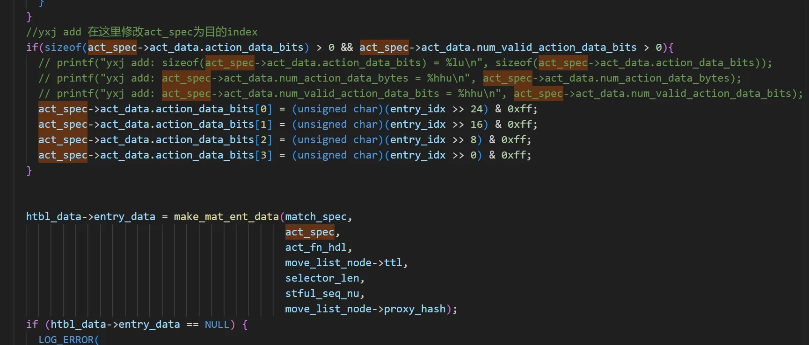
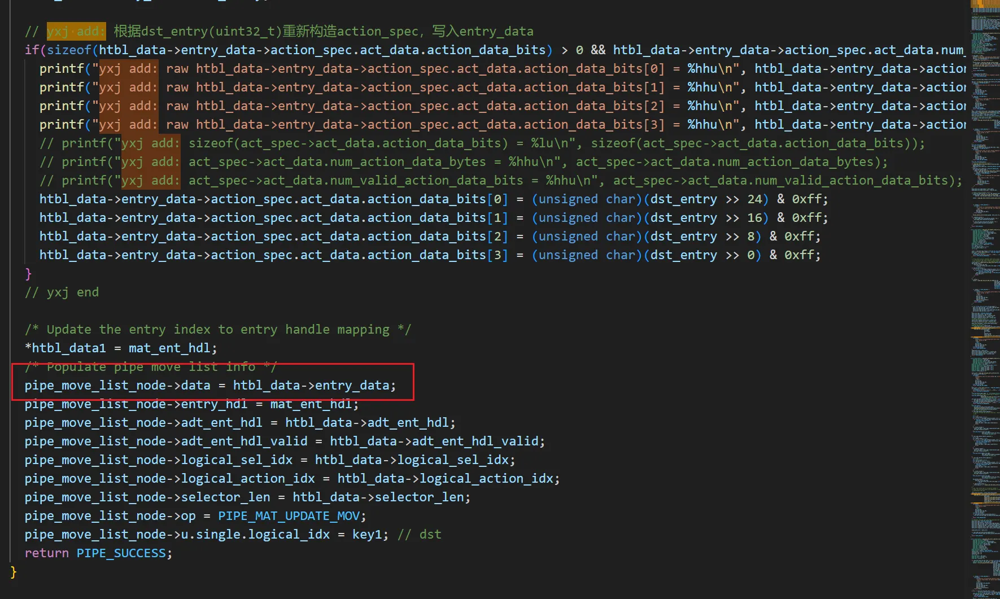
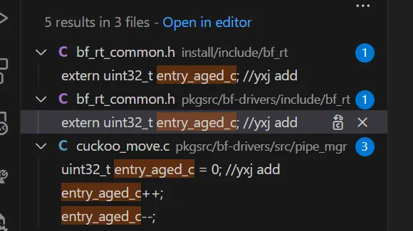

# Core Logic of Cuckoo Hash + BFS for Entry Management
## 1. Hardware/Software Data Structure Mapping
A forwarding table exists in the **hardware**, while a graph composed of `nodes` and `edges` is maintained in the **software**. 
- The multi-path hash values (4 paths) of each entry are remapped to the graph and associated with edges (e.g., 4 hash values → 4 edges).
- Each entry is stored as a `node` in the software; each node contains edges mapped from the entry's 4 hash values.
- Every edge points to a `node set` (consists of 2 nodes).
- BFS lookup/movement is executed by managing:
  1. States of entries stored in graph nodes
  2. States of node sets pointed to by edges

## 2. BFS Chain Search via Cuckoo Hash (Shortest Path Finding)
When searching for the BFS chain using **cuckoo hash**, BFS is adopted to find the shortest path. Workflow:
1. Start from the 4 edges of the node to be delivered → locate corresponding 4 node sets.
2. If no free slots in these 4 sets → continue iterative search within the sets:
   - Initiate search from the first node set (edge → index of first node in the set).
   - Traverse the 4 edges of this node → move to next node (index++) → traverse its edges.
   - Repeat until all node sets are fully traversed.

## 3. Free Node Position Confirmation
After identifying a node set with free slots:
- Only the set (not the exact position of the free node in the set) can be confirmed.
- Modify the initial moving node of the BFS chain → specify the exact free node index.

## 4. Node Movement & Graph Update
1. After modification: Move the node at `src` (source) position to `dst` (destination) position.
2. Update graph changes to the **hardware EM table** based on the BFS chain.

## 5. Driver-Level State Table Management
- A `state table` for entry rules is maintained in the driver (equivalent to hardware forwarding table + extra maintenance info).
- Modify this info via `move_list` to achieve **cuckoo move** effect.

### 5.1 Entry Movement Implementation (Core Process)
Start from the first node in the BFS chain (node to be moved to free slot):
1. Get `src` of the node → retrieve corresponding entry info:
   - `entry handle` (mapped to src)
   - `entry data (htbl_data)` (mapped to entry handle)
2. Mapping Relationships (maintained via **Judy arrays**):
   - src ↔ entry handle: Stored in `exm_tbl_data->ent_idx_to_ent_hdl_htbl` (src values + pointers to entry handles).
   - entry handle ↔ entry data: Stored in `exm_tbl->entry_info_htbl`.
3. Entry data contains critical info: `match key`, `action data`, etc.
4. Entry movement operation:
   - Modify the memory address pointed to by the entry handle of `src`.
   - Update content in entry data mapped to this entry handle simultaneously.

### 5.2 New Entry Insertion
- Allocate a new `entry handle` + corresponding `entry data` for the new entry.
- Note: The first node in the BFS chain is NOT a new insertion (only modify pointer references and entry data content).

# Some Implementation Details in the Code
In the **move list**, except for the node adjacent to the *empty node*—whose destination (`dst`) is assigned the value of the edge—all other nodes have their `dst` mapped to a specific node location (i.e., a concrete index). 
Thus, a **transform operation** is required to explicitly specify the `dst` of the last node, changing its mapping from an edge to a specific node index.

## 1. Graph Update Logic
After obtaining the modified move list, update the **graph** as follows:
- For node movement: Copy data from the source (`src`) node to the destination (`dst`) node.
- For new node insertion: Directly copy data from `edge_container` to the `dst` node.

## 2. Mapping Info Update (Node ↔ Hardware Flow Table)
The mapping info converts:
- Node index → entry handle (via `ent_idx_to_ent_hdl_htbl` table)
- Entry handle → specific entry details (via `entry_info_htbl` table)

### Key Notes:
- Fixed mappings (unchangeable): entry handle ↔ `entry_info_htbl` ↔ entry details (modify content only for entry movement).
- Variable mapping: node index ↔ entry handle (needs explicit update).

### Update Process:
1. Retrieve `src`-related info: entry handle, `entry_info_htbl`, entry details.
2. Retrieve `dst`-related info (same set as `src`).
3. Overwrite `dst` entry details with `src` entry details.
4. Redirect the pointer from `dst` mapping to `src` entry handle.

#### Special Case (Node Adjacent to Empty Node):
1. Create a new mapping for `dst` index (index → pointer to entry handle).
2. Direct this pointer to `src` entry handle.

#### New Entry Insertion:
After updating mappings, save modification operations and process to `pipe_move_list_node` (for hardware flow table replacement).

## 3. Entry Handle Allocation Risk
- Default entry handle is `1`.
- If the default entry is moved/deleted, new entries will be assigned handle `1` → treated as default entry → unexpected errors.

## 4. Aged Flag Implementation
Attempt to add **aged flag** by reusing `tableEntryMod` function.

### Table Entry Modification Call Chain:
```c
BfRtMatchActionTable::tableEntryMod
  → tableEntryModInternal
    → pipeMgrMatEntSetAction
      → pipe_mgr_mat_ent_set_action
        → pipe_mgr_exm_ent_set_action
          → pipe_mgr_exm_update_state_for_action_modify
```


# Aged Flag Implementation & NHop ID Issue Resolution
## 1. Aged Flag Addition via TableEntryAdd Reuse
An attempt is made to add the **aged flag** by reusing `tableEntryAdd` and modifying the `flags` field.
- Add the aged flag to nodes in the graph **before resources are deallocated**, then return immediately.

## 2. Entry Deletion Call Chain (Resource Check)
No resource deallocation was detected before calling the following functions:
```cpp
BfRtMatchActionTable::tableEntryDel // No resource deallocation detected before calling this function
  → pipeMgrMatEntDelByMatchSpec     // No resource deallocation detected before calling this function
    → pipe_mgr_mat_ent_del_by_match_spec // No resource deallocation detected before calling this function
      → pipe_mgr_mat_ent_del       // No resource deallocation detected before calling this function
        → pipe_mgr_exm_entry_del   // No resource deallocation detected before calling this function
          → pipe_mgr_exm_update_state
            → pipe_mgr_exm_update_state_for_entry_delete
```
## 3. Risk of Invalid pipe_move_list
- After update, move operations are added to `pipe_move_list`.
- Eventually, the `ml_api_fin` function updates the hardware based on `pipe_move_list`.
- If `pipe_mgr_exm_entry_del` (invoked within `pipe_mgr_mat_ent_del`) returns `PIPE_SUCCESS`, the move is deemed successful and `pipe_move_list` is marked valid.
- However, adding the aged flag **does not require `pipe_move_list`**, rendering it invalid in this scenario → potential errors may occur.

### Critical Note
The global flag `tag_aged` **must be cleared after use**!

## 4. Data Field Modification (Index Replacement)
*Requirement: Modify the `data` field to `index`.*
```cpp
const BfRtMatchActionTableData &match_data =
      static_cast<const BfRtMatchActionTableData &>(data);
pipe_action_spec = match_data.get_pipe_action_spec();
pipe_act_fn_hdl_t act_fn_hdl = match_data.getActFnHdl();
```

## 5. NHop ID Not Added to Hardware (Root Cause & Fix)
### 5.1 Issue Phenomenon
- `nhop_id` was not added to the hardware during program execution.
- No errors were found in the program or driver code.
- Suspected root cause: `nhop_id` failed to be passed in (its value remained 0).
- A comparison test with another codebase showed that the `action data` field was passed correctly.

### 5.2 Root Cause Analysis
- The driver and interface code were confirmed to be correct, but the `nhop_id` value was still 0.
- Analysis of the P4 code revealed that the `nhop_id` field was **unused** and thus inferred to have been optimized out by the compiler.

### 5.3 Resolution
The issue was resolved after explicitly referencing/using the `nhop_id` field in the P4 code.

### 5.4 Implementation Approach
When adding a new entry:
1. Modify the `nhop id` in the action spec to the **entry index** (the position of the entry calculated via cuckoo hash).
2. Special handling for the default entry:
   - A default entry is configured during initialization, which occupies `entry handle 1`.
   - Its action spec does not contain specific `action data` (i.e., no `nhop id`), so additional special handling is required. 
   - During BFS movement, set the new position as the `action data`.
   - To expose the internal parameters of the driver, modifications to multiple files are required. install/include/bf_rt should be the outermost interface.








